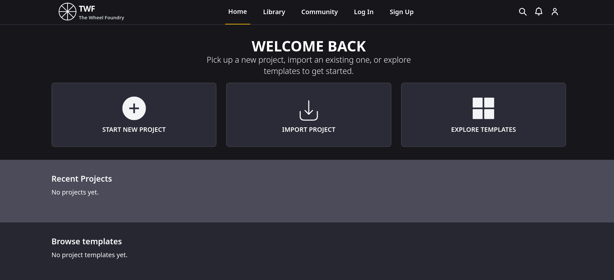

# The Wheel Foundry (TWF)

*The Wheel Foundry* is a web-based platform for creating, customizing, and using interactive "wheel-based" systems for everything from simple decision-making to complex character generation.
## Table of Contents

- [Early Look](#early-look)

- [Q&A](#qa)

- [Pages & Views](#pages--views)

- [Tech Stack](#tech-stack)

- [Current Goals](#current-1-10-goals)

- [Completed Goals](#completed-goals)

- [Environment Variables](#environment-variables)

- [Development Setup](#development-setup)

- [Development Workflow](#development-workflow)

- [Production Build](#production-build)
## Early Look

## Q&A

#### What purpose does this serve?

It allows users to create a single wheel for straightforward choices, connect multiple wheels together for systems such as D&D character creation, or build highly interconnected projects capable of generating entire stories, making the platform suitable for both casual and power users.

#### What kind of tools are available?

For advanced users, *The Wheel Foundry* provides advanced tools for defining conditions, effects, variables, tags, weighted outcomes, and interactions between wheels. These features allow the results of one wheel to dynamically influence others, enabling sophisticated procedural systems with branching logic and state-based behavior. This makes it possible to create complex generators for characters, events, scenarios, and narrative content.

#### Why use The Wheel Foundry?

The platform aims to make these systems easy to create, customize, share, and use through an intuitive visual editor, while providing features such as templates, importing, exporting and sharing projects, and optional cloud storage for users who create an account.

#### Do I need an account to use The Wheel Foundry?

No. The Wheel Foundry is designed to be usable without an account, allowing users to create, edit, and use projects locally without requiring registration. An account is only required for features that involve cloud storage, social interactions, user-specific data, privacy, or persistent access across devices. This includes saving projects to the cloud, sharing projects as well as subscription features. This approach allows users to use the core functionality of *The Wheel Foundry* freely.
## Pages & Views

- **Homepage:** Create or import new projects, view **recent projects**, and browse custom and premade **project templates** and **color schemes**.

- **Library:** Manage (create, move, rename, edit, delete, clone, fork...) your projects/folders. Switch from created, downloaded, favorited, and archived tabs. Sort by recently modified, creation date, name, downloads, likes, stars, forks...

- **Community:** Browse projects/color schemes shared by other creators, preview them, and fork your own copy. Switch from popular, trending and recent tabs. Sort by creation date, name, downloads, likes, stars, forks... Search for names, tags, categories, authors... 

- **Profile:** Showcase personal statistics such as project count, favorites, downloaded, forked, public and social statistics such as likes, downloads, forks... 
## Tech Stack

**Frontend:** HTML, Tailwind CSS, HTMX, TypeScript

**Backend:** Python, Django

**Database:** PostgreSQL (Docker container)

**Tools:** Docker Compose, Git, npm
## Current Goals

- Add project forms and views
- Add project routes
- Add project templates
## Completed Goals

- Create PostgreSQL database and run with Docker Compose
- Bring up the Django website
- Initialize the project with Git
- Build basic homepage
- Create project model
- Create user model
- Create sign up page
- Create sign up forms and validators
- Add sign up views and urls
## Environment Variables

The following environment variables are needed for the website to work.

### PostgreSQL

`POSTGRES_DB`

`POSTGRES_USER`

`POSTGRES_PASSWORD`

`POSTGRES_HOST`

`POSTGRES_PORT`

### Django

`SECRET_KEY`

`DJANGO_SETTINGS_MODULE` Set to config.settings.development/production/testing
## Development Setup

### 1. Clone the Repository

```bash
git clone <repository-url>
cd <project-directory>
```

### 2. Create and Activate the Virtual Environment

```bash
python -m venv .venv
```

Windows:

```powershell
.venv\Scripts\activate
```

### 3. Install Python Dependencies

```bash
pip install -r requirements.txt
```

### 4. Install Node Dependencies

```bash
npm install
```

### 5. Configure Environment Variables

Create a `.env` file in the project root and add the required environment variables.

### 6. Start the PostgreSQL Database

```bash
docker compose up -d
```

### 7. Apply Database Migrations

```bash
python manage.py migrate
```
## Development Workflow

After the initial setup, run the following processes:

#### Terminal 1 — PostgreSQL

If not already started:

```bash
docker compose up -d
```

#### Terminal 2 — Tailwind CSS

```bash
npm run dev:css
```

#### Terminal 3 — TypeScript

```bash
npm run dev:ts
```

Tailwind CSS and TypeScript run in watch mode during development and automatically rebuild when their source files change.

#### Terminal 4 — Django

```bash
python manage.py runserver
```

Or to make the website available from other devices in your LAN.

```bash
python manage.py runserver 0.0.0.0:8000
```

The website will be available at `http://127.0.0.1:8000/` for local access from the machine or `http://<LAN_IP>:8000/` for other devices.
## Production Build

To build the frontend assets without watch mode:

```bash
npm run build
```

This generates the production Tailwind CSS and compiled TypeScript output.
